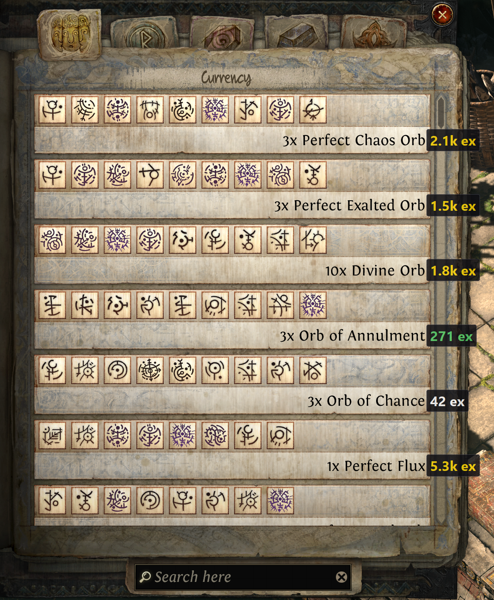

# Runeshape Pricer

A lightweight overlay for **Path of Exile 2** that shows the value (in **Exalted
Orbs** or **Divine Orbs**) of each **Runeshape Combinations** output right on
your screen. Open the panel, press **F3**, and the price appears next to every
row (it fades out after a few seconds, or stays up until you close the panel —
your choice in Settings).

Prices come live from **poe.ninja**. It **never touches the game** — it only
reads the screen (OCR) and draws on top (a transparent, click‑through overlay).

**Free and open-source.** No key, no login.



## Usage
1. Download **`RuneshapePricer.exe`** from [**Releases**](../../releases) and keep
   it in a normal folder (**not** `Program Files`).
2. In‑game, use **Windowed Fullscreen** (overlays don't show over *exclusive*
   fullscreen).
3. Open the **Runeshape Combinations** panel and press **F3**.

Tray icon → **Settings** (language, currency *ex/div*, hotkey, display time or
keep‑until‑panel‑closes, scan area) and **Quit**. Default language is English
(switchable to Polish in Settings).

## Requirements
- Windows 10/11.
- A **Windows OCR language pack** (any language works): *Settings → Time &
  language → Language → Options → Optical character recognition*.

## Price colours
🟡 ≥ 800 ex · 🟢 ≥ 50 ex · ⚪ ≥ 5 ex · ▫️ cheaper · 🟡 `?` = variable reward
(e.g. a unique) · `—` = not priced on poe.ninja.

## Building from source
```
pip install -r requirements.txt
python main.py                # run from source
pyinstaller --noconfirm --clean --distpath . --workpath build RuneshapePricer.spec
```
Requires Python 3.10+. Tuning tools: `python main.py selftest` (prices),
`python main.py ocr <image>` (OCR preview).

## Disclaimer
**Use at your own risk.** By downloading and using this software you take full
responsibility upon yourself and accept these terms. The author accepts **no
liability** for anything arising from its use — including, without limitation,
**account bans or suspensions, hardware damage, or data loss**.

---
*Unofficial tool. Not affiliated with or endorsed by Grinding Gear Games or
poe.ninja. Price data: poe.ninja.*

---

# Runeshape Pricer (Polski)

Nakładka do **Path of Exile 2** pokazująca ceny kombinacji *Runeshape* w
**Exaltach** lub **Divine** prosto na ekranie. Otwórz panel **Runeshape
Combinations**, naciśnij **F3** — obok każdego wiersza pojawi się jego wartość
(po chwili znika albo zostaje, aż zamkniesz panel — do wyboru w ustawieniach).

Ceny pobierane na żywo z **poe.ninja**. Program **nie ingeruje w grę** — tylko
czyta ekran (OCR) i rysuje na wierzchu (przezroczysta, „przeklikiwalna" nakładka).

**Darmowe i otwarte (open-source).** Bez klucza, bez logowania.

## Użycie
1. Pobierz **`RuneshapePricer.exe`** z zakładki [**Releases**](../../releases) i
   trzymaj w zwykłym folderze (**nie** w `Program Files`).
2. W grze ustaw **Windowed Fullscreen** (nad *exclusive* fullscreen nakładki się
   nie pokazują).
3. Otwórz panel **Runeshape Combinations** i naciśnij **F3**.

Ikona w zasobniku → **Settings** (język, waluta *ex/div*, skrót, czas
wyświetlania lub „trzymaj aż zamkniesz panel", obszar) i **Quit**. Domyślny
język: angielski (w Settings można zmienić na polski).

## Wymagania
- Windows 10/11.
- Pakiet **OCR Windows** (dowolny język): *Ustawienia → Czas i język → Język →
  Opcje → Optyczne rozpoznawanie znaków*.

## Kolory cen
🟡 ≥ 800 ex · 🟢 ≥ 50 ex · ⚪ ≥ 5 ex · ▫️ taniej · 🟡 `?` = nagroda zmienna
(np. unikat) · `—` = brak ceny na poe.ninja.

## Budowanie ze źródeł
```
pip install -r requirements.txt
python main.py                # uruchom ze źródeł
pyinstaller --noconfirm --clean --distpath . --workpath build RuneshapePricer.spec
```
Wymaga Pythona 3.10+. Narzędzia do strojenia: `python main.py selftest` (ceny),
`python main.py ocr <obraz>` (podgląd OCR).

## Zastrzeżenie
**Używasz na własną odpowiedzialność.** Pobierając i używając tego programu
bierzesz pełną odpowiedzialność na siebie i akceptujesz te warunki. Autor **nie
ponosi żadnej odpowiedzialności** za jakiekolwiek skutki używania — w
szczególności za **bany lub zawieszenia konta, uszkodzenia sprzętu czy utratę
danych**.

---
*Nieoficjalne narzędzie. Niepowiązane z Grinding Gear Games ani poe.ninja. Dane
cen: poe.ninja.*
